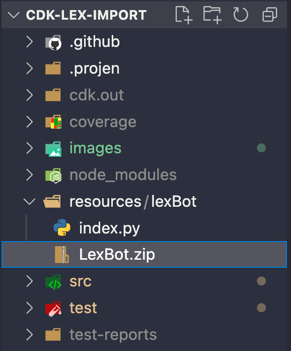

Amazon Lex Bots are a way to use natural language conversational interfaces that can be used through a variety of integrations such as Facebook and Slack. A Lex Bot can be built and deployed through the AWS console. However, it can also be deployed by CDK, Cloudformation, or SDK. In this post, I will explain how to import an existing Lex Bot using CDK and SDK.



After cloning [this repo](https://github.com/schuettc/cdk-lex-import), you will see a zipped LexBot in the `resources` directory. As part of the CDK, this file will be copied up with the Lex import Lambda. You can replace this Zip file with a Lex Bot of your choosing.

```typescript
const lexDeployLambda = new lambda.Function(this, 'lexDeployLambda', {
  runtime: lambda.Runtime.PYTHON_3_9,
  code: lambda.Code.fromAsset(path.join(__dirname, '../resources/lexBot')),
  handler: 'index.handler',
  architecture: lambda.Architecture.ARM_64,
  timeout: Duration.minutes(1),
  role: lexCustomResourceRole,
});

const uid: string = Names.uniqueId(this);

const LexResourceProvider = new cr.Provider(this, 'LexResourceProvider', {
  onEventHandler: lexDeployLambda,
});

const lexBot = new CustomResource(this, 'LexCustomResource', {
  serviceToken: LexResourceProvider.serviceToken,
  properties: { uid: uid, lex_role_arn: lexRole.roleArn },
});
```

While the CDK is being deployed, the Custom Resource Lambda will be triggered with a `Create` RequestType. This will cause the Lambda to begin the process of importing the bot.

```python
def create_bot(bot_name, lex_role_arn, account_id):
    response_data = {}
    upload_info = lex.create_upload_url()
    upload_bot(upload_info)
    import_bot(bot_name, upload_info["importId"], lex_role_arn)
    bot_id = get_bot_id(bot_name)
    bot_alias_id = get_bot_alias_id(bot_id)
    put_resource_policy(bot_id, bot_alias_id, account_id)
    build_bot(bot_id)
    response_data["bot_id"] = bot_id
    response_data["bot_alias_id"] = bot_alias_id
    return response_data
```

There are multiple steps required to import and build a Lex bot. This function will work through each of those.

The first step is to create a URL that will be used as part of the import. This is done with a single lexv2-models API call:

```python
upload_info = lex.create_upload_url()
```

Once this URL is created, it is passed to the upload_bot function and the `LexBot.zip` file is uploaded to the specified URL.

```python
def upload_bot(upload_info):
    http = urllib3.PoolManager()
    try:
        with open("LexBot.zip", mode="rb") as bot:
            file_data = bot.read()

    except Exception as e:
        error = {"error": f"Exception thrown: {e}"}
        print(error)
        raise Exception(error)
    try:
        upload = http.request(
            "PUT", upload_info["uploadUrl"], body=file_data, headers={"Content-Type": "application/zip"}
        )

    except Exception as e:
        error = {"error": f"Exception thrown: {e}"}
        print(error)
        raise Exception(error)
    logger.info(upload.data.decode("utf-8"))
    return upload
```

Once uploaded to S3, the bot must be imported.

```python
def import_bot(bot_name, import_id, lex_role_arn):
    bot_import_result = lex.start_import(
        importId=import_id,
        resourceSpecification={
            "botImportSpecification": {
                "botName": bot_name,
                "roleArn": lex_role_arn,
                "dataPrivacy": {"childDirected": False},
                "idleSessionTTLInSeconds": 600,
            },
        },
        mergeStrategy="Overwrite",
    )
    logger.info(bot_import_result)
    return bot_import_result
```

If a Resource Policy is required for your Bot, it can be added with the `put_resource_policy` function also included. The Bot will then be built and is now ready for use.

Once the Lambda has completed importing the Bot to Lex, it will return the bot_id and bot_alias_id to the CDK.

Once the Lex bot has been imported, it can be tested in the Lex console.


### Resources

- [GitHub Repo](https://github.com/schuettc/cdk-lex-import)
- [Amazon Lex](https://aws.amazon.com/lex/)
- [Boto3 - Lexv2-Models](https://boto3.amazonaws.com/v1/documentation/api/latest/reference/services/lexv2-models.html)
